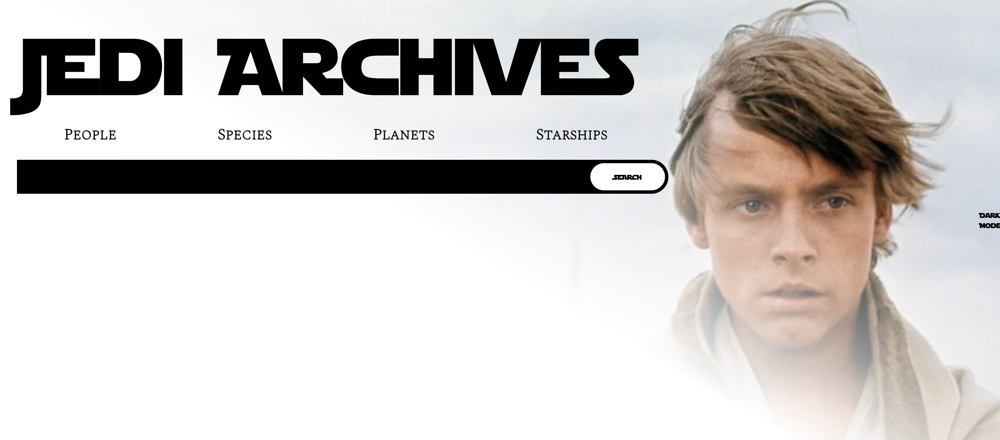
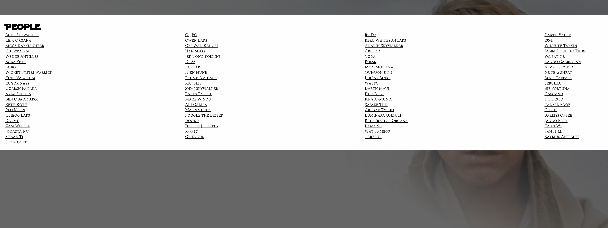
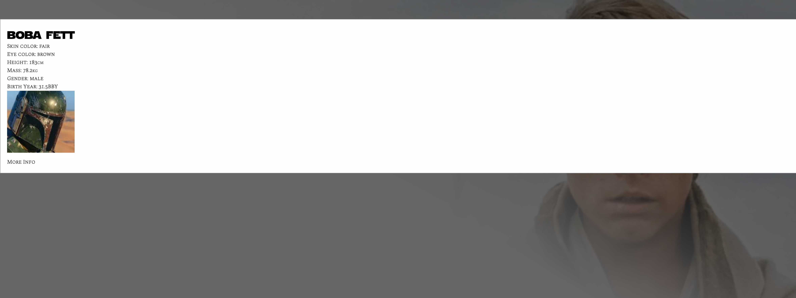

# Welcome to our StarWars Database!

The web application that allows you to traverse the vast database of the StarWars Database.

The application brings a dynamic search functionality for the characters, species, planets, ships, and films.
You can see the deployment of the application below.

[Live site](https://suedepritch.github.io/crispy-spork/)

# Technical Challenges

There were several technical challeges we faced during the initial development of this project which accounted for most of the time spent working. The main ones include:

* Learning Tailwind in just a few days
* Creating and implementing a custom search with autocomplete
* Creating and implementing a custom UI
* Utilizing the star wars api as it had severe limitations that required creative problem solving

# Technologies Used

This project would not be possible without the use of:

* Javascript/jQuery
* CSS/Tailwind
* StarWars API
* Wikipedia API

# Contributors

##  James Pritchard
* Lead Developer
* Troubleshooting
* API Wizard

## Ryan Acham
* Designer
* CSS Developer - Tailwind expert

## Eric Thmok
* Programmer (JavaScript)
* Troubleshooting

## Yonis Hussein
* Designer
* HTML

     